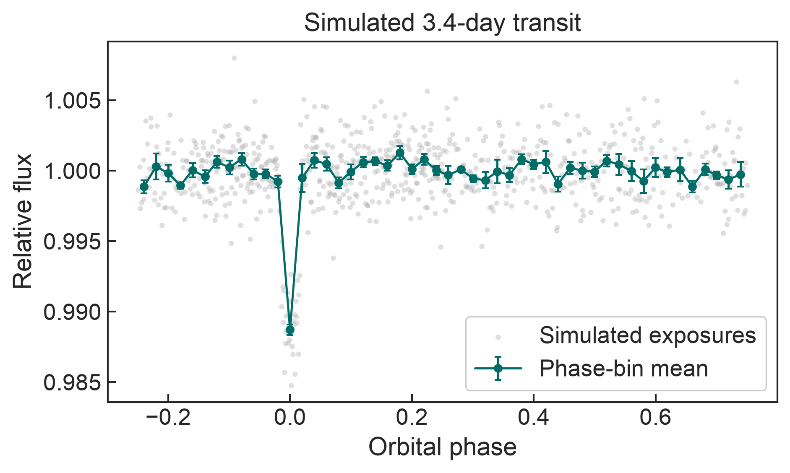

[German-ish for *everything-fitter*]

**Local setup:**

```bash
python -m pip install -e .
export ALLESFITTER_PATH=/path/to/allesfitter
```

`ALLESFITTER_PATH` identifies the repository root. Keep runtime inputs in `data/` and generated outputs in `visuals/`; both directories are ignored by Git.

**Simulated transit example:**

The lightweight example reads the bundled simulated Leonardo light curve and passes all 767 exposures through Allesfitter's phase-folding pipeline. It uses the injected 3.4-day orbital period and 1.1-day transit epoch, then compares the individual exposures with 50 phase-bin means.

```bash
python examples/simulated_transit_phase_fold.py --typefileplot png
```



The 1.1% transit remains visible after phase folding. The gray points are the simulated measurements and the green points show the mean and standard error in each populated phase bin. This deterministic diagnostic does not run a sampler or require optional inference dependencies.

*allesfitter* (Günther & Daylan, in prep.) is a public and user-friendly astronomy software package for modeling photometric and RV data. It can accommodate multiple exoplanets, multi-star systems, star spots, stellar flares, and various noise models. A graphical user interface allows to define all input. Then, *allesfitter* automatically runs a nested sampling or MCMC fit, and produces ascii tables, latex tables, and plots. For all this, *allesfitter* constructs an inference framework that unites the versatile packages *ellc* (light curve and RV models; Maxted 2016), *aflare* (flare model; Davenport et al. 2014), *dynesty* (static and dynamic nested sampling; https://github.com/joshspeagle/dynesty), *emcee* (Markov Chain Monte Carlo sampling; Foreman-Mackey et al. 2013) and *celerite* (Gaussian Process models; Foreman-Mackey et al. 2017). 
If you use *allesfitter* or parts of it in your work, please cite and acknowledge all software as detailed below.

**Documentation:**
https://allesfitter.readthedocs.io/en/latest/

**Citation:** 
*Günther \& Daylan, in prep.* 

**Acknowledgement:**
"This work makes use of the *allesfitter* package (*Günther \& Daylan, in prep.*), which is a convenient wrapper around the packages *ellc* (Maxted 2016), *aflare1.py* (Davenport 2014), *dynesty* (https://github.com/joshspeagle/dynesty), *emcee* (Foreman-Mackey 2013) and *celerite* (Foreman-Mackey 2017). This work makes further use of the *python* programming language (Rossum 1995) and the open-source *python* packages *numpy* (van der Walt, Colbert & Varoquaux 2011), *scipy* (Jones et al. 2001), *matplotlib* (Hunter 2007), *tqdm* (doi:10.5281/zenodo.1468033) and *seaborn* (https://seaborn.pydata.org/index.html)."

**Contributors:** 
Maximilian N. Günther, Tansu Daylan

**License:** 
The code is freely available at https://github.com/MNGuenther/allesfitter under the MIT License. Feedback and contributions are very welcome.
